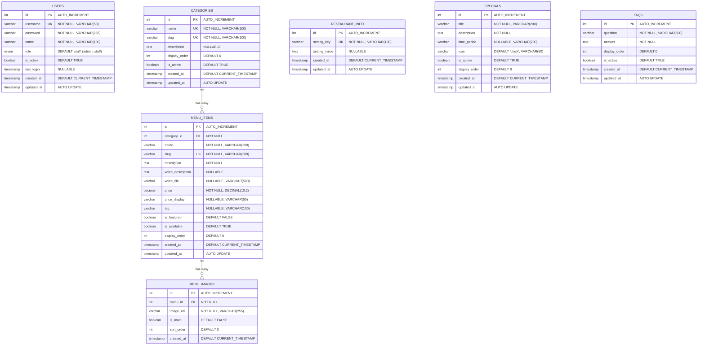
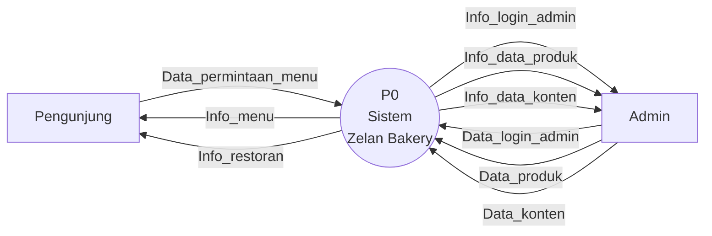
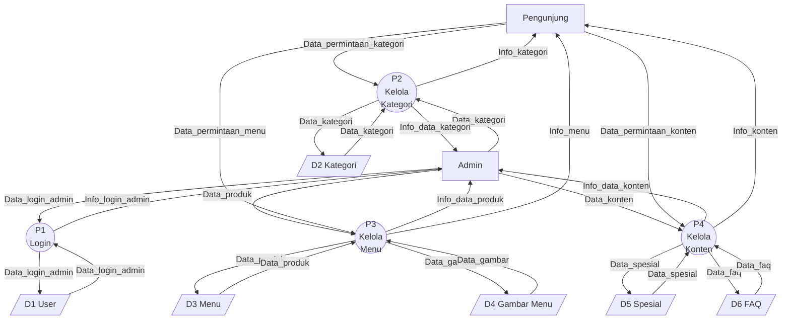
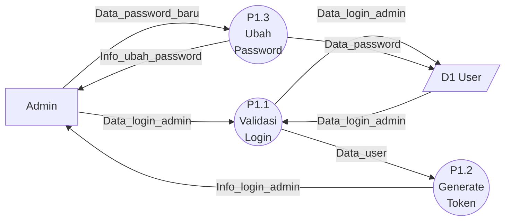
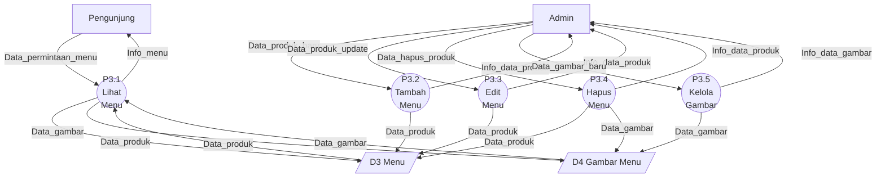

# Zelan Bakery & Cake - Database Documentation

## Table of Contents

1. [Entity Relationship Diagram (ERD)](#1-entity-relationship-diagram-erd)
2. [Data Flow Diagram (DFD)](#2-data-flow-diagram-dfd)
3. [Table Schema](#3-table-schema)
4. [API Endpoints Reference](#4-api-endpoints-reference)

---

## 1. Entity Relationship Diagram (ERD)

### 1.1 ERD Diagram

### 1.2 Relationship Summary

| Relationship | Type | Description | On Delete |
|---|---|---|---|
| `categories` -> `menu_items` | One-to-Many | One category has many menu items | RESTRICT |
| `menu_items` -> `menu_images` | One-to-Many | One menu item has many images | CASCADE |

### 1.3 Standalone Tables

| Table | Description |
|---|---|
| `users` | Authentication & authorization (no FK relations) |
| `restaurant_info` | Key-value store for restaurant settings |
| `specials` | Promotional offers & special events |
| `faqs` | Frequently asked questions |

---

## 2. Data Flow Diagram (DFD)

### 2.1 DFD Level 0 (Context Diagram)

### 2.2 DFD Level 1

### 2.3 DFD Level 2 - Proses 1 (Login)

### 2.4 DFD Level 2 - Proses 3 (Kelola Menu)

---

## 3. Table Schema

### 3.1 Table: `users`

> Stores admin and staff accounts for authentication.

| # | Column | Type | Constraints | Default | Description |
|---|--------|------|-------------|---------|-------------|
| 1 | `id` | INT | PK, AUTO_INCREMENT | - | Unique identifier |
| 2 | `username` | VARCHAR(50) | NOT NULL, UNIQUE | - | Login username |
| 3 | `password` | VARCHAR(255) | NOT NULL | - | Bcrypt hashed password |
| 4 | `name` | VARCHAR(100) | NOT NULL | - | Display name |
| 5 | `role` | ENUM('admin','staff') | - | 'staff' | User role |
| 6 | `is_active` | TINYINT(1) | - | TRUE | Account status |
| 7 | `last_login` | TIMESTAMP | NULLABLE | NULL | Last login timestamp |
| 8 | `created_at` | TIMESTAMP | - | CURRENT_TIMESTAMP | Record creation time |
| 9 | `updated_at` | TIMESTAMP | ON UPDATE | CURRENT_TIMESTAMP | Last modification time |

**Indexes:**
| Index Name | Type | Column(s) |
|---|---|---|
| PRIMARY | Primary Key | `id` |
| username | Unique | `username` |

---

### 3.2 Table: `categories`

> Menu categories for organizing products (e.g., Bakery, Cookies, Pastry).

| # | Column | Type | Constraints | Default | Description |
|---|--------|------|-------------|---------|-------------|
| 1 | `id` | INT | PK, AUTO_INCREMENT | - | Unique identifier |
| 2 | `name` | VARCHAR(100) | NOT NULL, UNIQUE | - | Category name |
| 3 | `slug` | VARCHAR(100) | NOT NULL, UNIQUE | - | URL-friendly identifier |
| 4 | `description` | TEXT | NULLABLE | NULL | Category description |
| 5 | `display_order` | INT | - | 0 | Sort order for display |
| 6 | `is_active` | TINYINT(1) | - | TRUE | Visibility status |
| 7 | `created_at` | TIMESTAMP | - | CURRENT_TIMESTAMP | Record creation time |
| 8 | `updated_at` | TIMESTAMP | ON UPDATE | CURRENT_TIMESTAMP | Last modification time |

**Indexes:**
| Index Name | Type | Column(s) |
|---|---|---|
| PRIMARY | Primary Key | `id` |
| name | Unique | `name` |
| slug | Unique | `slug` |

---

### 3.3 Table: `menu_items`

> Individual menu products with pricing, descriptions, and voice support.

| # | Column | Type | Constraints | Default | Description |
|---|--------|------|-------------|---------|-------------|
| 1 | `id` | INT | PK, AUTO_INCREMENT | - | Unique identifier |
| 2 | `category_id` | INT | FK, NOT NULL | - | Reference to categories |
| 3 | `name` | VARCHAR(200) | NOT NULL | - | Product name |
| 4 | `slug` | VARCHAR(200) | NOT NULL, UNIQUE | - | URL-friendly identifier |
| 5 | `description` | TEXT | NOT NULL | - | Short description |
| 6 | `voice_description` | TEXT | NULLABLE | NULL | Text for voice narration |
| 7 | `voice_file` | VARCHAR(500) | NULLABLE | NULL | Path to voice audio file |
| 8 | `price` | DECIMAL(10,2) | NOT NULL | - | Price in IDR |
| 9 | `price_display` | VARCHAR(50) | NULLABLE | NULL | Formatted price (e.g., "25K") |
| 10 | `tag` | VARCHAR(100) | NULLABLE | NULL | Label tag (e.g., "Best Seller") |
| 11 | `is_featured` | TINYINT(1) | - | FALSE | Featured product flag |
| 12 | `is_available` | TINYINT(1) | - | TRUE | Availability status |
| 13 | `display_order` | INT | - | 0 | Sort order within category |
| 14 | `created_at` | TIMESTAMP | - | CURRENT_TIMESTAMP | Record creation time |
| 15 | `updated_at` | TIMESTAMP | ON UPDATE | CURRENT_TIMESTAMP | Last modification time |

**Indexes:**
| Index Name | Type | Column(s) |
|---|---|---|
| PRIMARY | Primary Key | `id` |
| slug | Unique | `slug` |
| idx_category | Index | `category_id` |
| idx_available | Index | `is_available` |
| idx_featured | Index | `is_featured` |

**Foreign Keys:**
| Column | References | On Delete |
|---|---|---|
| `category_id` | `categories(id)` | RESTRICT |

---

### 3.4 Table: `menu_images`

> Multiple images per menu item with main image designation.

| # | Column | Type | Constraints | Default | Description |
|---|--------|------|-------------|---------|-------------|
| 1 | `id` | INT | PK, AUTO_INCREMENT | - | Unique identifier |
| 2 | `menu_id` | INT | FK, NOT NULL | - | Reference to menu_items |
| 3 | `image_url` | VARCHAR(255) | NOT NULL | - | Image file path |
| 4 | `is_main` | TINYINT(1) | - | FALSE | Main/primary image flag |
| 5 | `sort_order` | INT | - | 0 | Display order |
| 6 | `created_at` | TIMESTAMP | - | CURRENT_TIMESTAMP | Upload timestamp |

**Indexes:**
| Index Name | Type | Column(s) |
|---|---|---|
| PRIMARY | Primary Key | `id` |
| idx_menu_id | Index | `menu_id` |

**Foreign Keys:**
| Column | References | On Delete |
|---|---|---|
| `menu_id` | `menu_items(id)` | CASCADE |

---

### 3.5 Table: `restaurant_info`

> Key-value store for restaurant configuration and contact info.

| # | Column | Type | Constraints | Default | Description |
|---|--------|------|-------------|---------|-------------|
| 1 | `id` | INT | PK, AUTO_INCREMENT | - | Unique identifier |
| 2 | `setting_key` | VARCHAR(100) | NOT NULL, UNIQUE | - | Setting name |
| 3 | `setting_value` | TEXT | NULLABLE | NULL | Setting value |
| 4 | `created_at` | TIMESTAMP | - | CURRENT_TIMESTAMP | Record creation time |
| 5 | `updated_at` | TIMESTAMP | ON UPDATE | CURRENT_TIMESTAMP | Last modification time |

**Indexes:**
| Index Name | Type | Column(s) |
|---|---|---|
| PRIMARY | Primary Key | `id` |
| setting_key | Unique | `setting_key` |

**Current Settings:**
| Key | Example Value |
|---|---|
| `name` | Zelan Bakery & Cake |
| `tagline` | Freshly Baked with Love |
| `about` | (Company description) |
| `address` | Jl. Bung Tomo VII No. 5, ... |
| `phone` | 0895385455669 |
| `whatsapp` | 62895385455669 |
| `email` | zelanbakeryncake@gmail.com |
| `instagram` | https://www.instagram.com/zelanbakeryncake |
| `tiktok` | https://www.tiktok.com/@zelanbakeryncake |
| `hours` | 08:00 - 20:00 |
| `founded` | 19 Juni 2023 |
| `founders` | Lana Aristya & Zen |

---

### 3.6 Table: `specials`

> Promotional offers and special events.

| # | Column | Type | Constraints | Default | Description |
|---|--------|------|-------------|---------|-------------|
| 1 | `id` | INT | PK, AUTO_INCREMENT | - | Unique identifier |
| 2 | `title` | VARCHAR(200) | NOT NULL | - | Special offer title |
| 3 | `description` | TEXT | NOT NULL | - | Offer description |
| 4 | `time_period` | VARCHAR(200) | NULLABLE | NULL | Validity period text |
| 5 | `icon` | VARCHAR(50) | - | 'clock' | Icon identifier |
| 6 | `is_active` | TINYINT(1) | - | TRUE | Active status |
| 7 | `display_order` | INT | - | 0 | Sort order |
| 8 | `created_at` | TIMESTAMP | - | CURRENT_TIMESTAMP | Record creation time |
| 9 | `updated_at` | TIMESTAMP | ON UPDATE | CURRENT_TIMESTAMP | Last modification time |

**Indexes:**
| Index Name | Type | Column(s) |
|---|---|---|
| PRIMARY | Primary Key | `id` |

---

### 3.7 Table: `faqs`

> Frequently asked questions displayed on the website.

| # | Column | Type | Constraints | Default | Description |
|---|--------|------|-------------|---------|-------------|
| 1 | `id` | INT | PK, AUTO_INCREMENT | - | Unique identifier |
| 2 | `question` | VARCHAR(500) | NOT NULL | - | FAQ question text |
| 3 | `answer` | TEXT | NOT NULL | - | FAQ answer text |
| 4 | `display_order` | INT | - | 0 | Sort order |
| 5 | `is_active` | TINYINT(1) | - | TRUE | Visibility status |
| 6 | `created_at` | TIMESTAMP | - | CURRENT_TIMESTAMP | Record creation time |
| 7 | `updated_at` | TIMESTAMP | ON UPDATE | CURRENT_TIMESTAMP | Last modification time |

**Indexes:**
| Index Name | Type | Column(s) |
|---|---|---|
| PRIMARY | Primary Key | `id` |

---

## 4. API Endpoints Reference

### 4.1 Authentication

| Method | Endpoint | Auth | Description |
|--------|----------|------|-------------|
| POST | `/api/auth/login` | Public | User login |
| GET | `/api/auth/verify` | Public | Verify JWT token |
| POST | `/api/auth/refresh` | Public | Refresh JWT token |
| POST | `/api/auth/register` | Admin | Register new user |
| PUT | `/api/auth/change-password` | Auth | Change password |

### 4.2 Categories

| Method | Endpoint | Auth | Description |
|--------|----------|------|-------------|
| GET | `/api/categories` | Public | List all categories |
| GET | `/api/categories/:id` | Public | Get category by ID |
| POST | `/api/categories` | Auth | Create category |
| PUT | `/api/categories/:id` | Auth | Update category |
| DELETE | `/api/categories/:id` | Auth | Delete category |

### 4.3 Menu Items

| Method | Endpoint | Auth | Description |
|--------|----------|------|-------------|
| GET | `/api/menu` | Public | List all menu items |
| GET | `/api/menu/by-category` | Public | Get menu grouped by category |
| GET | `/api/menu/:id` | Public | Get menu item by ID |
| POST | `/api/menu` | Auth | Create menu item (with file upload) |
| PUT | `/api/menu/:id` | Auth | Update menu item (with file upload) |
| DELETE | `/api/menu/:id` | Auth | Delete menu item |
| POST | `/api/menu/:id/voice` | Auth | Upload voice file |

### 4.4 Menu Images

| Method | Endpoint | Auth | Description |
|--------|----------|------|-------------|
| GET | `/api/menu/:id/images` | Public | Get images for menu item |
| POST | `/api/menu/:id/images` | Auth | Upload image for menu item |
| DELETE | `/api/menu/:id/images/:imageId` | Auth | Delete specific image |
| PATCH | `/api/menu/:id/images/:imageId/main` | Auth | Set image as main |

### 4.5 Specials

| Method | Endpoint | Auth | Description |
|--------|----------|------|-------------|
| GET | `/api/specials` | Public | List all specials |
| GET | `/api/specials/:id` | Public | Get special by ID |
| POST | `/api/specials` | Auth | Create special |
| PUT | `/api/specials/:id` | Auth | Update special |
| DELETE | `/api/specials/:id` | Auth | Delete special |

### 4.6 FAQs

| Method | Endpoint | Auth | Description |
|--------|----------|------|-------------|
| GET | `/api/faqs` | Public | List all FAQs |
| GET | `/api/faqs/:id` | Public | Get FAQ by ID |
| POST | `/api/faqs` | Auth | Create FAQ |
| PUT | `/api/faqs/:id` | Auth | Update FAQ |
| DELETE | `/api/faqs/:id` | Auth | Delete FAQ |

### 4.7 Dashboard

| Method | Endpoint | Auth | Description |
|--------|----------|------|-------------|
| GET | `/api/stats` | Auth | Get dashboard statistics |
| GET | `/health` | Public | Health check |

---

## Technical Details

- **Database Engine:** MySQL 8.0 with InnoDB
- **Character Set:** utf8mb4 (Unicode support for Indonesian text)
- **Collation:** utf8mb4_unicode_ci
- **Connection Library:** mysql2/promise (connection pool)
- **Authentication:** JWT (JSON Web Tokens) + bcrypt password hashing
- **File Storage:** Local filesystem (`uploads/images/`, `uploads/voice/`)

---

*Generated on: February 2026*
*Database: zelan_bakery_db*
